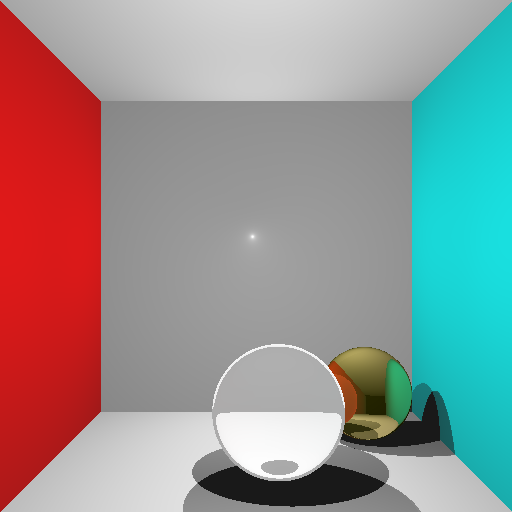

Steve Shea

cmps final project--Cornell Box Raytracer

note: program supports multi-sampled
images. This is currently used to emulate
soft shadows(by randomly varying light
locations across a normal distribution).
Could be used to implement monte-carlo
path tracing.

